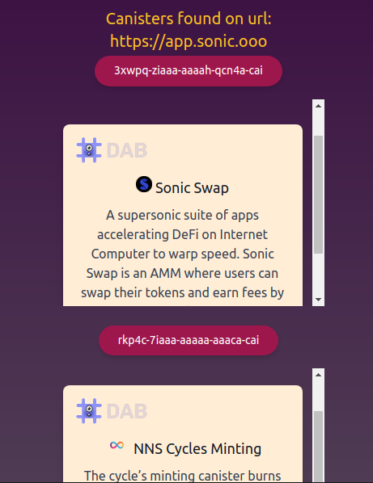

### CanCheck (Canister Check extension)

**CanCheck** is a browser extension used to verify Internet Computer Smart Contracts metadata (
Canisters)
for safer user experience during Internet Computer DApps usage

To get more details about extension architecture please
visit <a href='https://github.com/DunkanMcLoud/can-check/wiki'>CanCheck Wiki</a>

### Running and building application locally

To install dependencies run in app folder: `npm install`

1. For local development:
   `npm run dev`
2. For running jest tests: `npm run test`
3. To build a zip-package: `npm run build` (Build will appear in `release` folder)